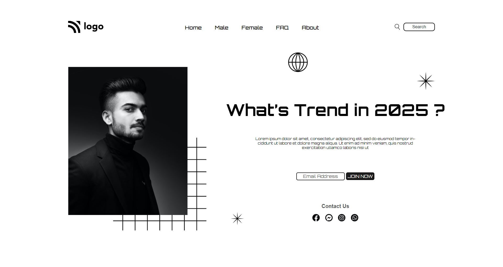

# Street Style Landing Page

---
## :link: [See it live on Netlify]() 

---

## :clipboard: Learning Outcomes 

- CSS Positioning (relative - absolute)
- Pseudo classes and elements like
    - `:hover`
    - `::after`
- Combine usage of two Pseudo classes like the use of `:not()` with `:last-of-type()`

## :camera: Screenshot
---

